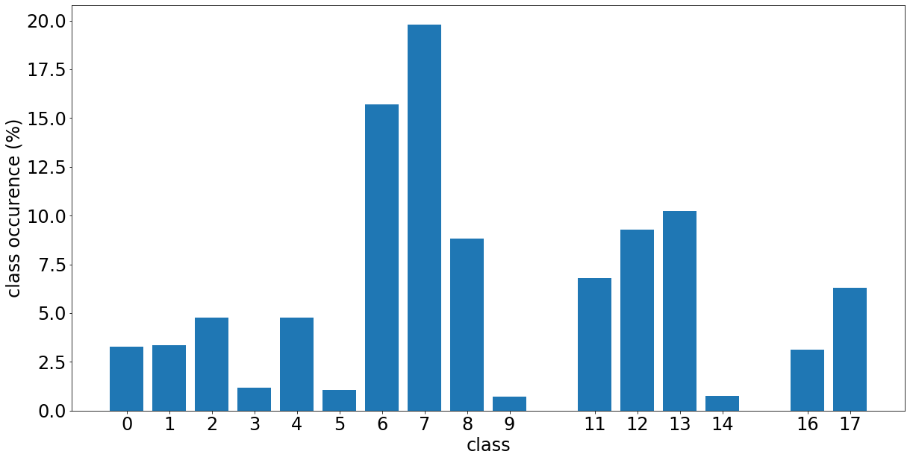
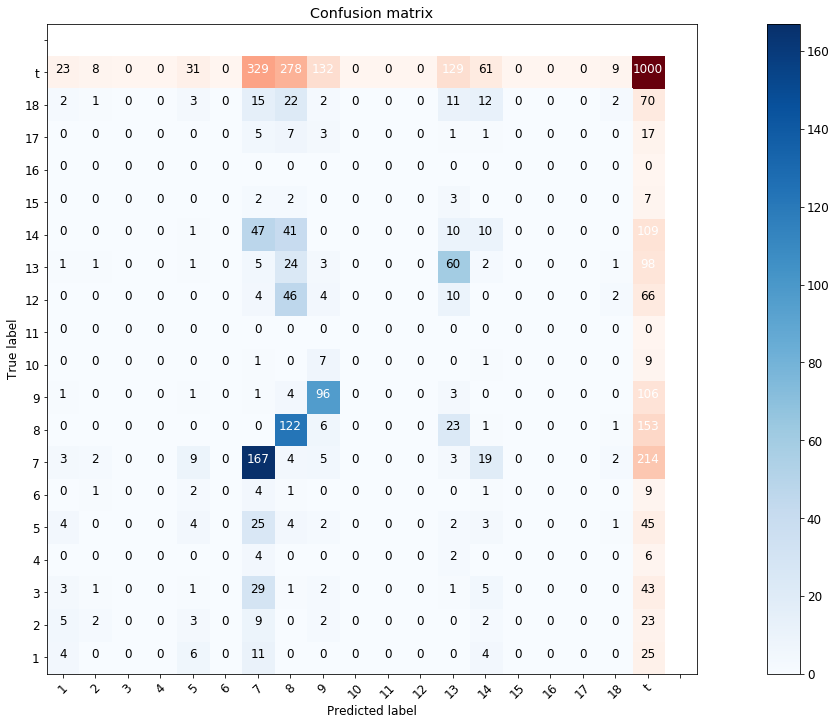
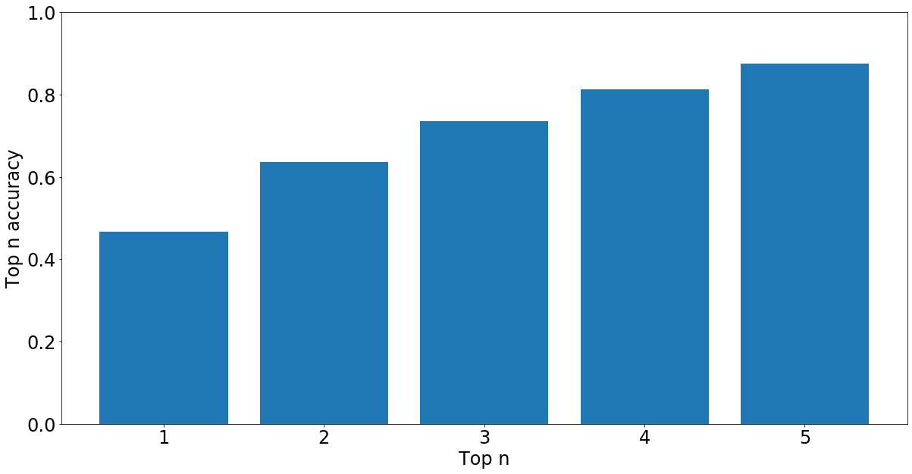

# Classificaiton of political intent in tweets

Based on ~5978 tweets from Dutch politiciants, this LSTM-based classifier tries to indentify what the intention of the tweet was, based on 18 classes. This reaches approximately 47% accoracy.
.
## Participants

 * prof. Marcel Broersma, principal investigator, University of Groningen, Faculty of Arts
 * dr. Marc Esteve del Valle, second principal investigator, University of Groningen, Faculty of Arts
 * MSc Herbert Teun Kruitbosch, data scientist, University of Groningen, Data science team
 * dr. Erik Tjong Kim Sang, data scientist, eScience Center

(The data science team is a group of 10 data scientists and alike that assist researchers from all faculties with data science and scientific programming, as part of the universities Center of Information Technology)

## Data

We have 5978 tweets which are annotated in 18 categories are:

 * SHARING FROM OWN NEWS OUTLET
 * SHARING FROM OTHER OUTLETS
 * SHARING FROM NON-MEDIA
 * LIVE REPORTING
 * SELF PROMOTION
 * OTHERS PROMOTION
 * OPINION, CRITIQUE, INTERPRETATION
 * ARGUING
 * REQUEST JOURN INPUT
 * REQUEST NON-JOURN INPUT
 * RETWEET REQUEST
 * ADVICE
 * ACKNOWLEDGEMENT
 * PERSONAL
 * ERROR CORRECTION
 * JOURNALISTIC REFLECTION
 * OTHER
 * UNKNOWN
 
These categories have the distribution of Figure 1.

<table>
  <tr>	
    <td>
  </tr>
  <tr>
    <td>Figure 1. Class distribution</td>
  </tr>
</table>

The 1000 most recent tweets were used as a test-set to avoid train-test contamination because tweets might be similar in the same time frame.

The data is owned by the principal investogator and hence not included in this git-repository.

# Model

We've used an ensemble of three models which performed the best in sample out of 10 trained models. Each model was a character-level LSTM.

## Results

This classifier obtained 47% accuracy on an out of data sample, Figure 2 and 3 show the confusion matrix and top-n accuracies.

<table>
  <tr>	
    <td>
  </tr>
  <tr>
    <td>Figure 2. Prediction confusion matrix</td>
  </tr>
  <tr>
    <td>
  </tr>
  <tr>
    <td>Figure 3. Top-n classification accuracy</td>
  </tr>
</table>

## Code

The twitterlib provides:

 - methods to scrape twitter by simulating a web browser session: `twitterlib.collection.scrape`
 - models to predict meta-information of a tweet using *TF-IFD and logistic regression* or a *Convolutional LSTM*.

## Implementation

We've applied our method in Google Colab using this [notebook](notebooks/Train%20Model.ipynb).

